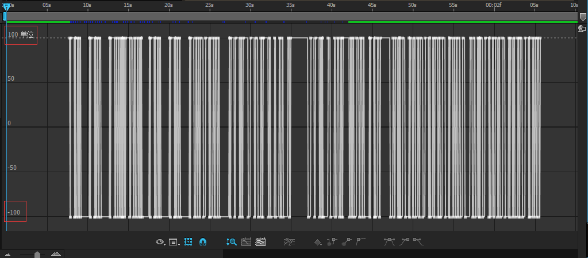

# 缩放

!!! note "版本信息"
    该特性包含于 NGDXW先辈 修改版 om_midi

[](../gallery/scale-sample1.png)

生成值为 `100` 或 `-100` 的关键帧，主要用于制作左右/上下抽动效果。

## 应用实例

!!! tip
    实例中的表达式仅供参考，实际情况可能有一定差别，请灵活运用。
    如果使用表达式关联器的话，通常不太需要关心第一行 `temp = .....`，应该关注第二行的 `[temp, temp]` 即对关键帧数据的处理上。

使用 AE 的表达式关联器为对应图层的**缩放**属性生成类似如下的表达式：

```javascript
temp = thisComp.layer("midi").effect("缩放")("滑块"); //该行以实际情况为准，示例内容仅供参考

[temp, temp]
```

这个时候播放，图层就会以锚点为轴心进行抽动。

### 左右抽动

还是上面的表达式，改成如下形式：

```javascript
temp = thisComp.layer("midi").effect("缩放")("滑块"); //该行以实际情况为准，示例内容仅供参考

[temp, 100]
```

此举会使垂直方向的缩放值恒为 `100` ,进而实现水平翻转的效果。

### 上下抽动

还是上面的表达式，改成如下形式：

```javascript
temp = thisComp.layer("midi").effect("缩放")("滑块"); //该行以实际情况为准，示例内容仅供参考

[100, temp]
```

此举会使水平方向的缩放值恒为 `100` ,进而实现垂直翻转的效果。

## 局限性

这些关键帧的值不是 `100` 就是 `-100` ,使得应用表达式的图层之缩放比例被限定为 `100%` ，且无法在应用表达式后手动调整缩放比例。

!!! note "有没有解决办法？"
    为什么不试试神奇的[高级缩放](adv-scale.md)呢？